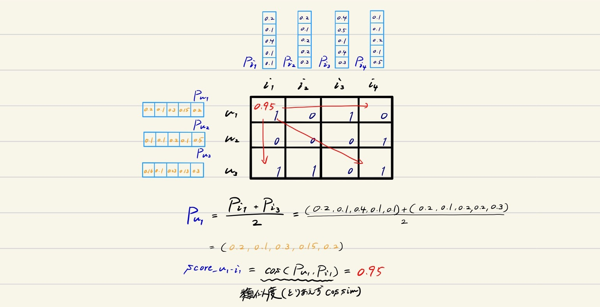

# データセット作成
## 手順
1. itemのプロファイルを定義（itemプロファイルベクトルをitem数だけ作成）
2. userの嗜好itemを選択
3. userのプロファイルを定義（userプロファイルベクトルをuser数だけ作成）
4. userベクトル, itemベクトルからuser iのitem jに対する評価値を決定。全user全itemに対して求め、matrixを作成する
5. 評価値の欠損率を変えて欠損データを複数パターン作成  

